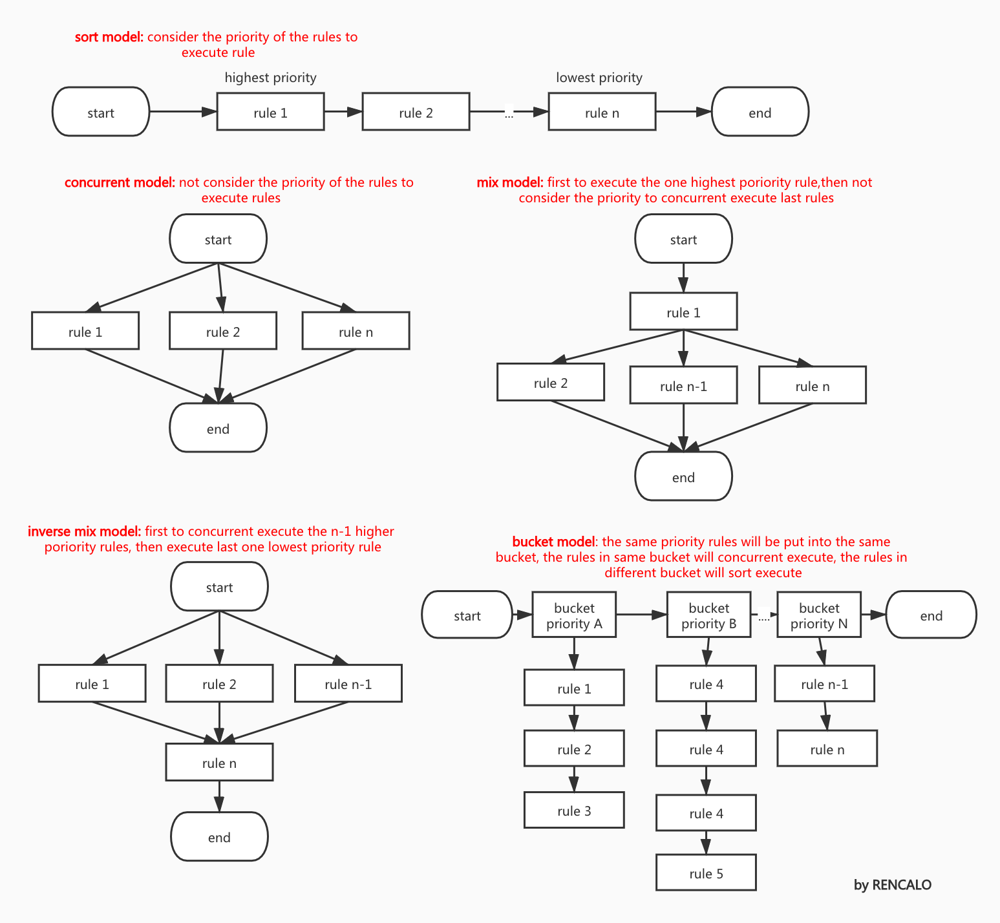

# Gengine
- [English](README.md)

## 官方文档
- https://rencalo770.github.io/gengine_doc

## 基于golang的规则引擎
- **Gengine**是一款基于AST(Abstract Syntax Tree)和golang语言实现的规则引擎。能够让你在golang这种静态语言上，在不停服务的情况下实现动态加载与配置规则。
- **代码结构松散，逻辑极其简单，但经过了必要且详尽的测试**
- Gengine所支持的规则，就是一门**DSL**(领域专用语言)

## 设计思想
可以看这篇文章: https://xie.infoq.cn/article/40bfff1fbca1867991a1453ac

## 规则执行模式
 

## Gengine支持的规则语法
- 支持规则优先级和规则执行条件，优先级高的先执行，优先级低的后执行；
- 支持的优先级范围 -int64 ～ int64 
- 支持中文规则名与中文规则描述
- 支持规则内定义变量，但规则内定义的变量在规则与规则之间的不可见
- 支持 if../if..else../if .. else if ... else  代码块和其代码块嵌套
- 支持复杂逻辑运算
- 支持复杂数学四则运算(+ -  * /)
- 支持结构体方法调用
- 支持单行注释(//)  
- 支持优雅的规则检错机制(是的,你没看错,就是检错,不是检测!):如果待加载的一批规则中有一个规则有语法错误，那么规则引擎就不会加载这批规则去执行,防止对数据造成不可预知的危害
- 支持仅有一个返回值的函数赋值，且返回值为基础类型或结构体; 支持多返回值函数的调用，但无法处理其返回值
- 支持直接注入函数并执行，并允许函数重命名
- 支持规则链中有规则执行失败时，是否继续执行后续规则开关
- 支持一些内置函数
- 支持使用@name 在规则体内获得当前规则的名称
- 支持基础类型的map, slice, array
- 支持规则池,代码位置gengine/engine/gengine_pool.go, 测试用例 gengine/test/Pool_test.go

## 使用
- go mod 或者 go vendor

## Gengine不支持的规则语法
- 不支持形如user.ip.ipRisk()这种多级调用，因为它不符合"迪米特法则"，并且会使代码变得难以理解；只支持ip.ipRisk()这种单级调用
- 不支持函数多个返回值，当需要返回多个值时，请使用返回结构体
- 不支持多行注释，因为不想支持
- 不支持nil 

## 书写规则需要注意的事情
- 如果规则的优先级不指定，多个规则将以未知次序执行
- 同一批待加载的规则中不能有重名规则

## 支持的基本数据类型
- string 
- bool  
- int, int8, int16, int32, int64   
- float32, float64

## 支持的逻辑运算符
- &&  且 
- ||  或
- !   非

## 支持的比较运算符
- ==   等于
- !=   不等于
- \>   大于
-  <   小于
-  \>= 大于等于 
- <=   小于等于

## 支持的算术运算符
-  \+ 加
-  \- 减
-  \* 乘
-  /  除
- 支持int,uint,float任意两者之间的加减乘除, 以及string与string之间的加法

## 支持的括号
- 圆括号

## Gengine规则示例
```go
//规则
rule "测试" "测试描述"  salience 0 
begin
		// 重命名函数 测试
		Sout("XXXXXXXXXX")
		// 普通函数 测试
		Hello()
		//结构提方法 测试
		User.Say()
		// if
		if !(7 == User.GetNum(7)) || !(7 > 8)  {
			//自定义变量 和 加法 测试
			variable = "hello" + (" world" + "zeze")
			// 加法 与 内建函数 测试
			User.Name = "hhh" + strconv.FormatBool(true)
			//结构体属性、方法调用 和 除法 测试
			User.Age = User.GetNum(8976) / 1000+ 3*(1+1) 
			//布尔值设置 测试
			User.Male = false
			//规则内自定义变量调用 测试
			User.Print(variable)
			//float测试	也支持科学计数法		
			f = 9.56			
			PrintReal(f)
			//嵌套if-else测试
			if false	{
				Sout("嵌套if测试")
			}else{
				Sout("嵌套else测试")
			}
		}else{ //else
			//字符串设置 测试
			User.Name = "yyyy"
		}
end
```

## Gengine完整的规则加载并执行的代码示例
- 所有代码，在test测试包可见
```go

import (
	"fmt"
	"gengine/base"
	"gengine/builder"
	"gengine/context"
	"gengine/engine"
	"github.com/sirupsen/logrus"
	"testing"
	"time"
)

type User struct {
	Name string
	Age  int
	Male bool
}

func (u *User)GetNum(i int64) int64 {
	return i
}

func (u *User)Print(s string){
	fmt.Println(s)
}

func (u *User)Say(){
	fmt.Println("hello world")
}

const (
	rule2 = `
rule "测试" "测试描述"  salience 0 
begin
		// 重命名函数 测试
		Sout("XXXXXXXXXX")
		// 普通函数 测试
		Hello()
		//结构提方法 测试
		User.Say()
		// if
		if 7 == User.GetNum(7){
			//自定义变量 和 加法 测试
			variable = "hello" + " world"
			// 加法 与 内建函数 测试
			User.Name = "hhh" + strconv.FormatBool(true)
			//结构体属性、方法调用 和 除法 测试
			User.Age = User.GetNum(89767999999) / 10000000
			//布尔值设置 测试
			User.Male = false
			//规则内自定义变量调用 测试
			User.Print(variable)
			//float测试	也支持科学计数法		
			f = 9.56			
			PrintReal(f)
			//嵌套if-else测试
			if false	{
				Sout("嵌套if测试")
			}else{
				Sout("嵌套else测试")
			}
		}else{ //else
			//字符串设置 测试
			User.Name = "yyyy"
		}
end`)

func Hello()  {
	fmt.Println("hello")
}

func PrintReal(real float64){
	fmt.Println(real)
}

func exe(user *User){
	/**
	 不要注入除函数和结构体指针以外的其他类型(如变量)
	 */
	dataContext := context.NewDataContext()
	//inject struct
	dataContext.Add("User", user)
	//rename and inject
	dataContext.Add("Sout",fmt.Println)
	//直接注入函数
	dataContext.Add("Hello",Hello)
	dataContext.Add("PrintReal",PrintReal)

	//init rule engine 
	knowledgeContext := base.NewKnowledgeContext()
	ruleBuilder := builder.NewRuleBuilder(knowledgeContext, dataContext)

	//resolve rules from string 
	err := ruleBuilder.BuildRuleFromString(rule2)
	if err != nil{
		logrus.Errorf("err:%s ", err)
	}else{
		eng := engine.NewGengine()

		start := time.Now().UnixNano()
		// true: means when there are many rules， if one rule execute error，continue to execute rules after the occur error rule
		err := eng.Execute(ruleBuilder, true)
		end := time.Now().UnixNano()
		if err != nil{
			logrus.Errorf("execute rule error: %v", err)
		}
		logrus.Infof("execute rule cost %d ns",end-start)
		logrus.Infof("user.Age=%d,Name=%s,Male=%t", user.Age, user.Name, user.Male)
	}
}

func Test_Base(t *testing.T){
	user := &User{
		Name: "Calo",
		Age:  0,
		Male: true,
	}
	exe(user)
}

```

## 注意 和最佳实践
- 如果你想获得高执行效率，请将 规则的构建过程和规则的执行过程相分离 
- 如果你的规则中包含耗时，比如操作数据库，那么建议你用engine.ExecuteConcurrent(...) ,如果没有,建议你仍然用engine.Execute(...)
- 规则引擎支持混合执行模式，优先执行一个最高优先级的规则，剩下的规则以并发的模式执行
- 最新版本会兼容所有老版本功能

## 授权
- 哔哩哔哩官方授权开源 ( www.bilibili.com)
- 基于BSD开源协议授权 

## 问题联系
- 提issue，或者联系
- renyunyi@bilibili.com (因为公司屏蔽等原因，可能会接受不到邮件)
- M201476117@alumni.hust.edu.cn
